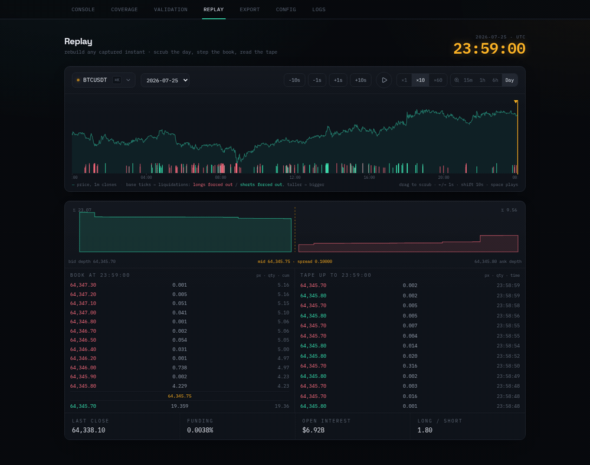
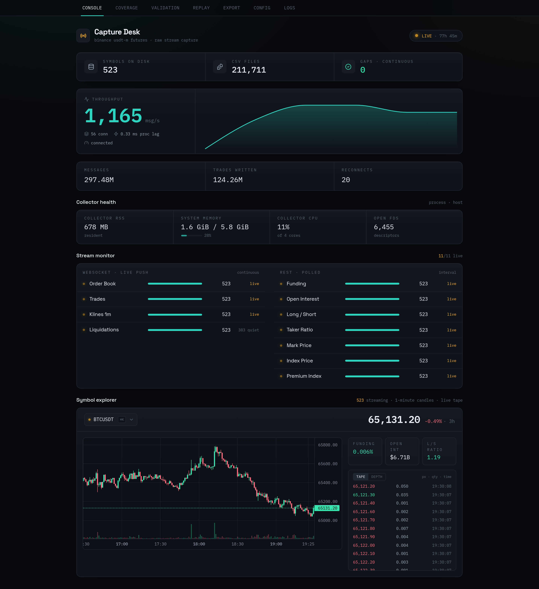

# binance-futures-collector

[](https://github.com/waynemason1/binance-futures-collector/actions/workflows/ci.yml)


> Published as-is and not actively maintained: no roadmap, no support
> commitment. It works and it is documented; fork it freely. See
> [CONTRIBUTING.md](CONTRIBUTING.md).

A single-process collector that captures the full Binance USDT-M perpetual
futures tape (every symbol, twelve capture streams across eleven on-disk
directories) to plain CSV, gap-tracked, on commodity hardware.



*The dashboard's Replay tab: a captured liquidation cascade, rebuilt from the
CSVs on disk and played back.*

It runs the whole ~500-symbol universe on a fraction of one CPU core and a
bounded memory footprint, from a single residential connection: no colocation,
no proxies, no API keys. The order book is reconstructed from a REST snapshot
plus the diff stream with full update-ID continuity checking; every
discontinuity and recovery is recorded, so a downstream consumer knows exactly
where the tape is whole and where it isn't. The included dashboard shows that
health live: per-stream freshness, coverage, and a replay/validation view that
re-verifies any captured day from the files on disk. The validators are
themselves tested against seeded corruption, so "the data is clean" is a
checked claim, not a hope.

Raw capture only. No signals, no feature engineering. The job is to get the
data down, correctly, and keep it down for weeks at a time. Extracted and
hardened from a six-month private trading-research system; this repo is the
capture layer, open-sourced standalone.

**Two names, one repo.** The collector itself is `binance-futures-collector`:
the Rust binary that does the capturing, and the only part you need. The bundled
dashboard is **Capture Desk**, which is why the containers and images carry that
name. The dashboard is optional and reads the collector's output off disk rather
than talking to it, so the collector runs perfectly well without it. (The one
concession in the other direction: discovery always includes `btcusdt` and
`dogeusdt`, because the dashboard's replay and validation views assume they are
present.)

---

## What it captures

| Stream | Transport | Notes |
|---|---|---|
| Order book depth (diff) | WebSocket | 100 / 250 / 500 ms; snapshot + diff reconstruction |
| Order book snapshots | WebSocket + REST | initial sync, bridge attach, and periodic re-serialization |
| Aggregated trades | WebSocket | deduplicated by aggregate trade ID |
| Klines (1m) | WebSocket | per symbol |
| Liquidations | WebSocket | market-wide `!forceOrder@arr`, filtered to the collected USDT-M universe |
| Funding rates | REST | |
| Open interest | REST | |
| Long/short ratios | REST | global account, top-trader account, top-trader position |
| Taker buy/sell ratio | REST | |
| Mark-price klines | REST | 1m |
| Index-price klines | REST | 1m |
| Premium-index klines | REST | 1m |

The bucketed series (klines, ratios) are polled as a window of historical
buckets rather than the latest value alone, so the full native series is
preserved even at slow poll rates; funding and open interest are point-in-time
metrics and are sampled on each poll. Either way the endpoints stay well under
their rate limits (see [rate limiting](#rate-limiting)).

---

## Quick start

No API key required: the collector reads only public Binance market data.
Capture grows roughly 40 GB/day at all ~500 pairs / 500 ms, and scales with
cadence: halving the interval roughly doubles it, so 250 ms is about 80 GB/day and
100 ms about 200. Point storage at a disk with room to spare, or use a symbol
whitelist. `./setup.sh` works this out from your answers and tells you how many
days of headroom you have.

Option A needs nothing but the download. Options B to D work from a clone:

```sh
git clone https://github.com/waynemason1/binance-futures-collector.git
cd binance-futures-collector
./setup.sh --check     # optional: verify this machine can run it, installs nothing
```

`--check` confirms the toolchain (or Docker daemon), disk headroom, and that
Binance is actually reachable from your network, then exits. Worth thirty seconds
before building anything.

### Option A: Download a prebuilt binary (nothing to install)

The collector is a single self-contained executable. Grab the archive for your
platform from the [latest release](https://github.com/waynemason1/binance-futures-collector/releases/latest):

```sh
tar -xzf binance-futures-collector-*.tar.gz
cd binance-futures-collector-*/
cp config.example.toml config.toml     # edit `symbols` / `update_speed_ms` if you like
./binance-futures-collector
```

No Rust, Node, Python or Docker. This gives you capture only; the dashboard is
optional and needs one of the paths below. Check what you have with
`./binance-futures-collector --version`.

Prebuilt for **Linux x86_64** and **macOS (Apple silicon)**. Any other platform,
including Intel Macs, builds from source with `cargo build --release`.

### Option B: Docker (collector + dashboard, one command)

```sh
cp config.example.toml config.toml   # edit `symbols` / `update_speed_ms` if you like
cp .env.example .env                  # optional: DATA_PATH (a big disk), DASHBOARD_PORT
docker compose up -d --build
```

Dashboard → `http://localhost:3010`. Capture persists in a Docker volume, or on a
host disk if you set `DATA_PATH`.

### Option C: Guided install (wizard)

```sh
./setup.sh
```

Asks first whether to run in Docker or build natively, then walks the same
questions either way: data directory (with free-space and GB/day estimates), all
pairs or a whitelist, order-book cadence, and the optional read-only key. It
writes `config.toml` from your answers, builds, and starts both services.
Dashboard → `http://localhost:3010` on the Docker path, `http://localhost:8000`
on the native one. Prerequisites are only checked for the path you pick, so the
Docker route needs no Rust, Node or Python on the host.

### Option D: Manual

```sh
cargo build --release
cp config.example.toml config.toml    # `symbols = []` = everything; a list restricts it
./target/release/binance-futures-collector
```

Run the dashboard separately if you want it. It needs Node 24 LTS or newer with
npm 11+, and Python 3.10 or later. macOS ships 3.9 as the default `python3`, so
substitute whichever newer interpreter you have (`python3.12`, `python3.13`) in
the venv line below:

```sh
cd dashboard/frontend && npm ci && npm run build && cd -
cd dashboard/backend && python3 -m venv .venv && .venv/bin/pip install -r requirements.txt
SERVE_STATIC=1 .venv/bin/python -m uvicorn server:app --host 127.0.0.1 --port 8000   # -> :8000
```

Data lands under `<data>/futures/<datatype>/<symbol>/<date>/`, logs under `./logs/`,
and a heartbeat at `<data>/stats/stats.json`. The process raises its own
file-descriptor limit and needs no elevated privileges. Startup across ~500 symbols
is staged over ~30–40 minutes to stay inside Binance's rate limits; after that it
runs indefinitely.

An API key is not required. If you want requests associated with your account,
set `api_key` in `config.toml` and make it **read-only**: enable reading only,
disable trading and withdrawals, IP-restrict it. Never use a key with trade or
withdrawal permissions.

---

## Output

```
data/futures/
├── orderbooks/btcusdt/2026-07-03/btcusdt_depth_updates_2026-07-03_1300-to-1400.csv
├── trades/btcusdt/2026-07-03/btcusdt_trades_2026-07-03.csv
├── klines/ethusdt/2026-07-03/ethusdt_klines_2026-07-03.csv
├── funding_rates/…
├── open_interest/…
└── …
```

One CSV per symbol per data type per day (order-book depth diffs rotate hourly),
header on the first line. Every row
begins `exchange,market,datatype,timestamp_ms,datetime_utc,symbol` followed by
type-specific columns; [`docs/SCHEMA.md`](docs/SCHEMA.md) has the exact layout
of each. Timestamps are exchange time in UTC milliseconds, with the same instant
repeated as an ISO-8601 string for grep-ability.

### A capture layer, not a database

The on-disk format is intentional. The collector's one job is durable capture,
so it writes append-only, Hive-partitioned files (`datatype/symbol/date`) and
leaves storage and query to a downstream layer of your choosing. Append-only
flat files are a hard capture target to beat: nothing to corrupt, no
schema migration, crash-safe to the line, and readable with `grep` or `pandas`
and zero tooling. A database in the write path would only add a failure mode: if
it goes down, collection stops.

CSV trades compactness and typing for legibility and portability, which is the
right trade for raw capture. Querying is a separate concern, and deliberately left
to you: the output is plain CSV in a predictable directory layout, so whatever you
already use to read CSV will read it.

For slicing a window without writing any code, the dashboard's Export tab does it
from the UI: pick a symbol, a time range and the data types, and get either a
bundle of native CSVs or a single time-aligned matrix on a 1-minute grid.

---

## Design

The collector is a set of independent async tasks over a shared, bounded writer.
A short tour:

- **Order book integrity.** A symbol goes live only after its REST snapshot is
  bridged into the buffered diff stream with a verified `U`/`u`/`pu` chain;
  stale or unbridgeable snapshots trigger an immediate re-snapshot with
  exponential backoff. Every persisted depth row keeps its update IDs, so the
  book is fully reconstructable, and auditable, offline.
- **Rate limiting.** <a name="rate-limiting"></a>Binance enforces two
  independent per-IP limits: a request-*weight* budget on `/fapi` and a tighter
  request-*count* budget on `/futures/data`. Both are modelled with
  rolling-window limiters behind a shared circuit breaker. Any `429`/`418`, or a
  near-ceiling used-weight header, pauses every request path together and honours
  `Retry-After`, instead of letting one endpoint hammer the IP into a longer ban.
- **Bounded memory.** Per-symbol ring buffers have hard caps; the order book is
  trimmed to the configured depth on every update; per-file write buffers are
  small by design. The footprint plateaus rather than creeping.
- **Gap accounting.** Recoveries are logged to a per-symbol registry, and the raw
  streams retain the sequence IDs needed to detect any gap in post-processing.
- **Clean output.** Depth diffs are sorted by update ID before write, trades are
  deduplicated, and headers are written once and flushed immediately so a crash
  can't produce a duplicate-header file.

[`docs/ARCHITECTURE.md`](docs/ARCHITECTURE.md) covers the full data flow, and
[`docs/ORDERBOOK.md`](docs/ORDERBOOK.md) is a deep dive on order-book sync,
reconnect handling, and offline reconstruction, the part most people ask about.

---

## Performance

Measured on the reference deployment, a 4-vCPU / 6 GB Linux VM on a Mac Mini,
capturing all 523 USDT-M perpetuals (twelve capture streams, eleven on-disk
directories) at 500 ms depth over a
single residential connection:

| Metric | Steady state |
|---|---|
| Throughput | ~1,000 messages/s sustained (daily means 1,000–1,200; bursts past 2,000) |
| CPU | ~0.6 of one core across 4 vCPUs (~40 threads: 8 tokio workers + blocking pool + jemalloc background threads); I/O-bound, nearing one core only during snapshot writes and high-volume bursts |
| Resident memory | 0.4–0.8 GB sawtooth, bounded; floors and ceilings hold day over day (6.2-day soak, 552 M messages) |
| Disk | ~35 GB/day measured at 500 ms (varies 30-50 with volatility; plan for ~40) |
| Cold start | ~30–40 min to full coverage (staggered on purpose) |

**Memory is bounded by construction and by the allocator.** Every heavy
structure is capped (fixed per-symbol ring buffers, order books trimmed to
depth on every update, a bounded trade-dedup window), and on Linux the collector
runs on jemalloc with a background purge thread, so pages freed by the hourly
and daily buffer rotations are returned to the OS on a decay timer instead of
ratcheting toward a daily high-water mark. That claim is measured, not assumed:
a 48 h glibc baseline showed the arena allocator creeping ~15–20 MB/day with
zero code leaks, and the 6.2-day jemalloc run that replaced it held flat floors
on clean days and decayed back to baseline within ~48 h after two real network
incidents. Methodology, charts, and the sampler script itself in
[`docs/SOAK_TEST.md`](docs/SOAK_TEST.md).

**Startup is staggered on purpose.** Order books come online in batches so a
restart never fires ~500 REST snapshots at once, the same rate-limit discipline
that lets a mass reconnect recover cleanly: killing every connection at once
re-syncs with *zero* resnapshots, and the in-memory book self-heals back to the
exchange (see [`docs/ORDERBOOK.md`](docs/ORDERBOOK.md)). In normal operation the
collector runs with zero reconnects and zero rate-limit bans.

---

## Configuration

Everything lives in `config.toml` (copy from `config.example.toml`). The knobs
you're most likely to touch:

| Key | Purpose |
|---|---|
| `[collection] symbols` | `[]` collects all discovered perpetuals; a list restricts to those |
| `[orderbook] update_speed_ms` | diff-depth cadence (100 / 250 / 500) |
| `[rest_intervals] *_seconds` | polling cadence per REST metric |
| `[rest_intervals] max_weight_per_min` | `/fapi` weight budget (Binance IP limit is 2400) |
| `[rest_intervals] max_data_requests_per_5min` | `/futures/data` request budget |
| `[output] buffer_size_kb` | per-file write-buffer size |
| `[storage] disable_*_persistence_for` | optionally skip raw trades/depth for named symbols to save disk |

Symbol exclusions (stablecoins, and any pairs you don't want) live in
[`exclusions.toml`](exclusions.toml); it's optional. The config path can be
overridden with `CONFIG_PATH`.

---

## Monitoring dashboard



`dashboard/` is a small FastAPI + React app that reads the collector's output
directly, with no database, and shows live throughput, per-stream status, on-disk
coverage, and a per-symbol order-book/trade view. It's optional and fully
decoupled from capture.

> **Trust model.** The dashboard has no authentication and exposes state-changing
> endpoints (edit config, request restart), so it binds to `127.0.0.1` by default
> and is meant for localhost or a trusted LAN. Put it behind a reverse proxy with
> auth before exposing it beyond that. State-changing POSTs also require an
> `X-Capture-Desk: 1` header (the UI sends it; add it to scripted calls), which
> stops cross-site request forgery from a browser that can reach the port.

The Replay tab rebuilds any captured second from the files on disk: scrub a
day's timeline (liquidations marked along the base) and the order book, depth
profile, trade tape, and funding/OI/positioning context are reconstructed as of
that instant, then stepped or played forward. If an arbitrary second can be
rebuilt, the capture around it is whole; the Validation tab tests the same
property formally, re-verifying update-id continuity, per-type invariants, and
a full book rebuild for any day on disk. [docs/REPLAY.md](docs/REPLAY.md)
covers both the UI and the mechanics.

---

## Requirements

The collector builds on current stable Rust (2021 edition) on Linux or macOS;
that is what CI tests, and no minimum version is enforced in `Cargo.toml`. TLS is
pure-Rust (rustls), so there is no OpenSSL or `pkg-config` to install. The
optional dashboard needs Node with npm 11+ (Node 24 LTS or newer; npm 10
mis-reads this lockfile's optional peer dependencies and refuses `npm ci`) and
Python 3.10+; macOS ships Python 3.9 as the default `python3`, so use
`python3.12` or newer from Homebrew (`./setup.sh` picks a suitable interpreter
itself).

The Docker path needs none of that, but it does need Docker itself, with the
daemon running: Docker Desktop, Colima or OrbStack on macOS, Docker Engine on
Linux. Nothing is bundled. `./setup.sh` checks the daemon is actually reachable
before offering the container path, rather than failing at the last step.

Size the disk to your capture: the full universe writes tens of GB a day
(~40 GB at all ~500 pairs / 500 ms, and roughly double that at 250 ms), dominated
by order-book depth. A symbol whitelist or the `[storage]` toggles trim it.

Only public market-data endpoints are used; no account or API key is required.
A read-only key is supported if you want requests tied to your account.

**Binance must be reachable from your network.** The API is geo-restricted in
some jurisdictions, including the US, where requests are refused with HTTP 451.
`./setup.sh --check` tests this up front so you find out in seconds rather than
after a build. Note that `binance.us` is a separate exchange with a different API
and is not supported here.

---

## Upgrading

Your configuration and your captured data are both gitignored, so pulling a newer
version cannot overwrite either: `config.toml`, `data/` and `logs/` stay exactly as
they are.

**Docker**

```sh
git pull
docker compose up -d --build
```

Compose stops the collector with SIGTERM, which `scripts/supervise.sh` forwards so
the collector runs its full drain: stop ingest, finish in-flight updates, flush
every open CSV buffer, save the gap registry. `stop_grace_period` in
`docker-compose.yml` allows 150 s for that, because a full-universe flush touches
thousands of files and does not fit in Docker's 10 s default.

**Native**

```sh
git pull
cargo build --release
cd dashboard/frontend && npm ci && npm run build && cd -
```

Stop the running collector with `SIGTERM` (`kill -TERM <pid>`, or Ctrl-C in its
terminal) and let it exit on its own before restarting. Do not `kill -9`: that
skips the flush and drops whatever is still buffered.

**If you downloaded a ZIP rather than cloning**, there is no `git pull`. Copy your
`config.toml` somewhere safe, unpack the new version, copy it back, then rebuild.
Cloning is easier to keep current.

**After upgrading, diff your `config.toml` against `config.example.toml`.** Most
keys are required rather than optional: only a handful carry `serde` defaults, so
if a release adds a key your existing config will fail to parse at startup and the
collector will refuse to start, naming the missing field. That is deliberate, a
loud failure beats booting with a silently wrong setting, but it does mean a
config diff is part of upgrading.

```sh
diff <(grep -oE '^[a-z_]+' config.toml | sort -u) \
     <(grep -oE '^[a-z_]+' config.example.toml | sort -u)
```

Re-running `./setup.sh` regenerates a current config from your answers and backs
the old one up to `config.toml.bak.<timestamp>` first.

The capture format is stable; days written by an older version stay readable and
the dashboard's Validation tab still verifies them.

---

## License

MIT. See [`LICENSE`](LICENSE).
