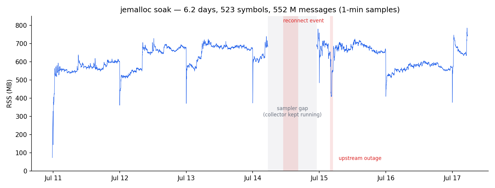
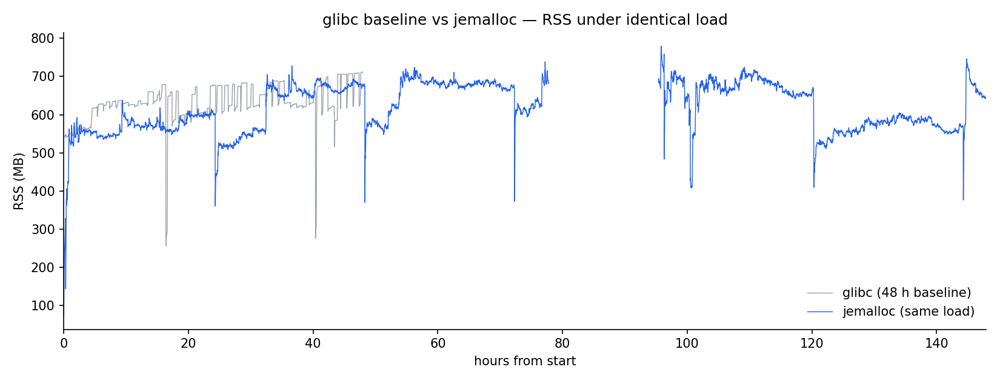

# Memory soak test

Long-run memory behaviour of the collector under full production load: 523 USDT-M
perpetual symbols, every stream enabled, measured at one-minute resolution by an
external sampler reading `/proc` (RSS, VmHWM, fds, message rate), with a day-file
handoff integrity check at every UTC midnight.

Two runs, same load: a 48-hour glibc baseline that surfaced an allocator-level
ratchet, and a 6.2-day jemalloc run of 552 million messages, seven UTC midnights,
two real network incidents, that settled the question. Verdict up front:
**memory is bounded. It plateaus, steps up under network-stress events, and
decays back to baseline within about 48 hours. There is no ongoing creep.**

## Why this test exists

A collector is only as trustworthy as its behaviour on day three. Steady-state
correctness is easy to demonstrate; slow memory growth, rotation leaks, and data loss
at day boundaries only show up when the process runs across multiple UTC midnights
under real load. So the collector is soaked for days at a time and judged on three
questions:

1. Does memory stay bounded, not just within a day, but day over day?
2. Does the midnight day-file rotation lose data? (Order-book `pu`-chain must be
   exact across the boundary; the update stream is checked symbol by symbol.)
3. Does anything degrade: errors, reconnects, stream health?

## Baseline: glibc malloc (48 h, 2026-07-06 → 07-08)

Result: **rock-solid operationally, but memory was not flat.**

- **Integrity: perfect.** Both midnight rotations chained exactly (`last u` of the old
  day == `first pu` of the new day on every checked symbol). Zero errors, zero
  reconnects, 523/523 order books live for the entire run.
- **Two-tier sawtooth.** Each top-of-hour rotation finalises ~500 order-book files and
  releases ~5–90 MB (scaling with market activity); each midnight rotation finalises
  every datatype and releases ~400 MB (679→256 MB, 661→275 MB).
- **A slow ratchet under the sawtooth.** At constant load, RSS drifted upward
  ~7 MB/h within a day, and the daily ceiling crept up across days:
  **679 → 689 → 711 MB** over three days. `VmHWM == VmRSS` throughout; the peak
  only ever ratcheted.

Root cause (established by code review plus `/proc/<pid>/smaps`): no live-object leak
(order books prune zero-quantity levels, per-symbol state is bounded), but glibc's
arena allocator does not return freed pages to the OS for this workload. With ~40
threads and no `MALLOC_ARENA_MAX` cap, glibc runs dozens of arenas; the hourly churn
of thousands of 64 KB write buffers leaves each arena holding freed pages (~15
anonymous 20–35 MB regions in smaps). Classic fragmentation ratchet, accumulating
~15–20 MB/day.

## The fix: jemalloc

`tikv-jemallocator` (jemalloc 5.3) as the global allocator, gated to Linux; see
`Cargo.toml` and the allocator declaration at the top of `src/main.rs`. The key
part is the embedded run-time configuration in `.cargo/config.toml`:

```
JEMALLOC_SYS_WITH_MALLOC_CONF = "background_thread:true,dirty_decay_ms:10000,muzzy_decay_ms:10000"
```

`background_thread:true` is what makes memory return *guaranteed* rather than
best-effort: jemalloc purges freed pages on the decay timer from dedicated
background purge threads (4 `jemalloc_bg_thd` threads here, visible in
`/proc/<pid>/task/*/comm`) even when the process is quiet. Without it, decay only runs piggybacked on later allocations, and quiet hours
ratchet the high-water mark, the same failure mode being fixed.

Verifying the config took effect (the string is compiled in via
`--with-malloc-conf`, so this is worth checking after any rebuild):

```
$ strings target/release/binance-futures-collector | grep background_thread
background_thread:true,dirty_decay_ms:10000,muzzy_decay_ms:10000

$ _RJEM_MALLOC_CONF=confirm_conf:true ./target/release/binance-futures-collector
<jemalloc>: malloc_conf #1 (string specified via --with-malloc-conf): "background_thread:true,..."
<jemalloc>: -- Set conf value: background_thread:true
```

(Note the `_RJEM_` prefix: tikv builds jemalloc with prefixed symbols, so the plain
`MALLOC_CONF` environment variable is ignored.)

One measurement nuance: `muzzy_decay_ms:10000` means freed pages pass through a
`MADV_FREE` stage (still counted in RSS, visible as `LazyFree` in
`/proc/<pid>/smaps_rollup`) before being returned ~10–20 s later, so short-window
RSS readings lag churn slightly.

## Re-soak: jemalloc (6.2 days, 2026-07-10 → 07-17)

Same methodology, same load. 523 symbols, every stream, 552 million messages,
7,859 one-minute samples across seven UTC midnights. The pass criteria going in:
midnight rotations lossless, and memory *bounded* day over day. The hourly and
daily sawtooth is real buffer lifecycle and may stay; what fails the test is a
floor or ceiling that only ever goes up.



### Day by day

| Day (UTC) | Character | Post-midnight floor (MB) | Day peak (MB) | Notes |
|---|---|---|---|---|
| Jul 11 | ramp | 144 | 637 | staggered startup; books reach 523/523 in ~40 min |
| Jul 12 | clean | 361 | 728 | |
| Jul 13 | clean | 370 | 724 | |
| Jul 14 | degraded | 373 | 779 | reconnect cluster 10:57–16:25 (link flap; ~50 reconnects) |
| Jul 15 | degraded | 484 | 759 | upstream outage ~03:50; hundreds of reconnects as the link flapped |
| Jul 16 | clean | 409 | 604 | |
| Jul 17 | (partial) | 376 | 785 | sampler hit its configured end at 05:29 |

Two things in that table decide the verdict.

**Clean days are flat.** Jul 12 → 13 floors moved +10 MB, then +3 MB; the
within-day RSS slope on clean days is actually slightly *negative* (−0.3 to
−1.6 MB/h over the 06:00–23:00 fit); the background purge thread keeps up with
churn at ~1,000 messages/s. Normalized, the floor moved 0.3 MB per 10 M messages
between the clean pair. glibc never produced a flat day.

**Stress steps decay.** The Jul 14/15 events stepped the floor 373 → 484 MB:
a mass-reconnect window mints thousands of fresh file buffers into a heap
fragmented by the event itself, and jemalloc only returns fully-free extents.
The same mechanism then unwound: 484 → 409 → 376 over the following two days,
landing 3 MB above the pre-event floor with 193 M more messages ingested. VmHWM
over the final 2.5 days moved 780.0 → 788.9 MB. That is the difference between
a fragmentation transient and a leak: a leak never gives the memory back.

### Integrity under stress

The soak's operational record is the stronger result:

- **All seven midnight rotations chained exactly**: `last u` of the old day ==
  `first pu` of the new day on every checked symbol, including the midnights
  bracketing both network events. (Jul 11's check covered btc/eth only; solusdt's
  book was still in its staggered startup at 00:02 and had no file to check yet.)
- **Both incidents self-healed with zero resnapshots.** The Jul 14 flap and the
  Jul 15 outage produced exactly 33 error lines between them (zero on clean
  days), 523/523 books held or recovered on every reconnect, and the gaps the
  outage did cause are *recorded*, and the update-id chain makes them detectable
  rather than silent.
- The sampler itself died once (Jul 14, 05:29–23:07, shaded in the chart) and
  was relaunched; the collector ran through it. Judged against the run's own
  log and data files, not just the sampler CSV.

### glibc vs jemalloc



Same workload, same VM. glibc's daily ceilings crept 679 → 689 → 711 MB across
three days with `VmHWM == VmRSS` the whole way; the high-water mark only ever
ratcheted, ~15–20 MB/day, with no code-level leak behind it. jemalloc's ceilings
show no trend (728, 724, 779, 759, 604), its floors mean-revert after stress,
and freed pages actually leave the process on the decay timer. The sawtooth
shape survives: it reflects the hourly and daily buffer lifecycle, and it is
supposed to. But the envelope is now stationary.

One honest caveat: 6.2 days is long enough to rule out steady creep at this
workload, and the run happened to include two genuine network incidents as free
stress tests. It says nothing about multi-week horizons. The exact instrument
behind every number here ships as `scripts/soak_monitor.sh`. Point it at a
running collector and it produces the same CSV and midnight integrity log, so
the claim is re-checkable on your deployment, not just this one.
